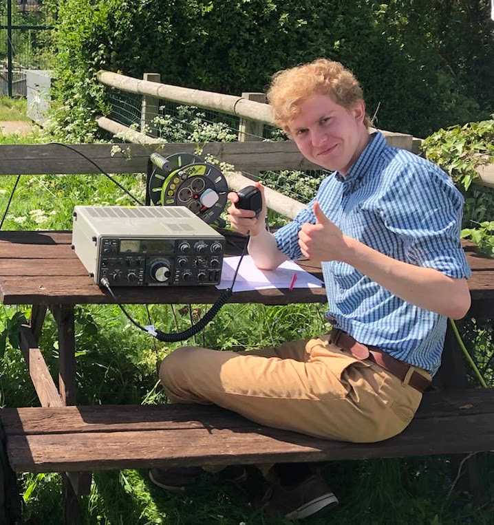

<h1><b>M0KRH</b></h1>

**Hello there!**

My name is Caspar and I am a licenced radio amateur currently studying Aerospace Engineering at the University of Surrey. All my electronics knowledge is fully self taught.

I currently operate as M0KRH (as you may have already figured out from the website name), previously 2E0KRH and M6OWI, along with being the keeper for GB3TY.

This website is intended to document my projects for future reference and for others to browse through, hopefully inspired!

Really interested in learning about microwave, satcom and radar - hoping to use/build lots of equipment surrounding those topics.