

# **Blue cap LNB to 3cm Transmitter Conversion**

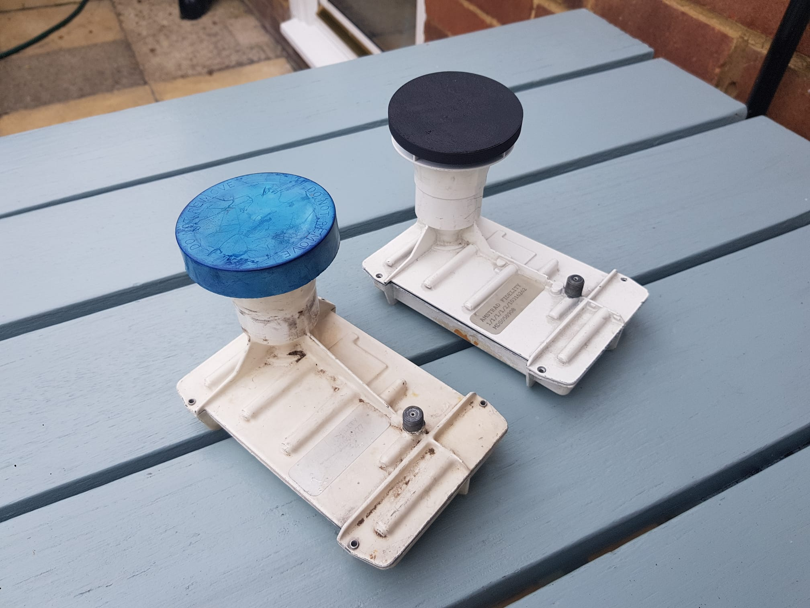

## Introduction 

**Blue cap LNBs** (named after their distinctive horn cover) were the standard voltage switching LNB fitted set to receive Sky analogue on Astra 1. The first Amstrad dishes were packaged with this LNB and painted with a white metal frame compared to the black Marconi variant.

Unfortunately, these LNBs can't be used for their intended purpose today (2024) in Europe as there are no analogue satellite TV channels available.

However, we can still make use of these on the amateur radio bands by converting them to a 3cm (10 GHz) transmitter. This has been done by other amateurs to create ATV transmitters, however, I will be converting mine for a different purpose for a future project.

I picked up my LNB out of the 'pre-loved' pile at my local amateur radio club a few years ago hoping in the future I would learn enough to make use of them. Satisfyingly, I can say that after gaining knowledge since I completed that objective.

  

    Table of contents
  

  {: .text-delta }
1. TOC
{:toc}

Big credit to [F6BGR](https://f6bgr.wordpress.com/2015/07/29/tete-satellite-transformee-en-tx-10-ghz/) who made a tutorial in 2000 describing the process. Despite the instructions being translated from French they were very useful. Original from PA3GCO.

## The Result

<video src="media/bluecap_demo.mp4" height="500" controls></video>

The end result from this project was being able to turn the LNB into a transmitter by recieving a 10 GHz signal on a seperate unmodifided blue cap.

## Internals

    

        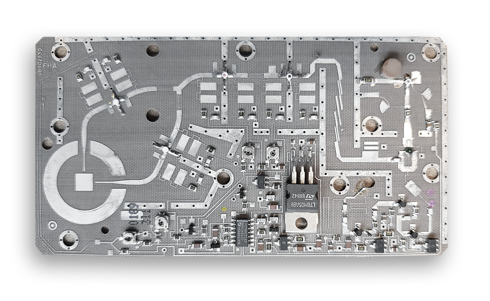
    

    

		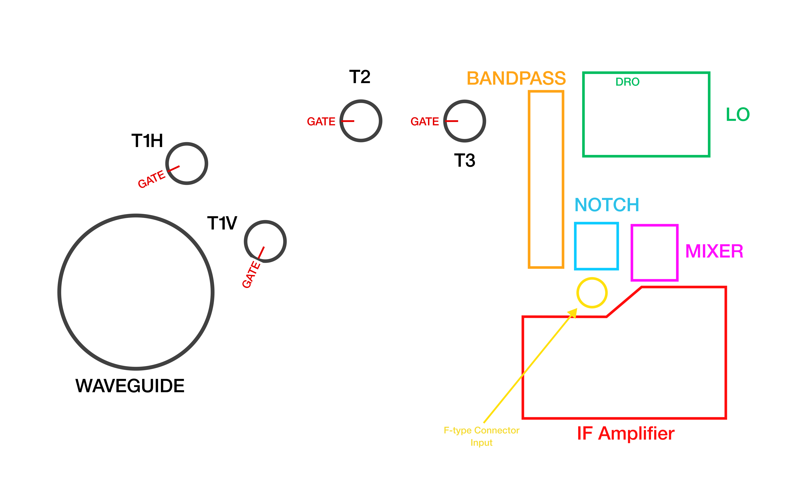
    

<i>Hover over the image to remove the labels</i>

Listed above in my diagram is the main components of the LNB. To compelte the conversion these will be the main areas of focus.

This LNB works by amplifying any received signal from the waveguide through a series of GASFETs shown as 'T#'. Only T1H or T1V are on at a time, never both as controlled by the input DC voltage from the F-type connector determining the polarization.

The signals are filtered through a bandpass filter and a further notch filter before entering the mixer. The Local Oscillator (LO) is produced by a Dielectric Resonant Oscillator (DRO) operating at around 10 GHz, the frequency of which can be tuned by a tuning screw on the screening case.

The mixer mixes the received signals with the LO to get the Intermediate Frequency (IF) that would usually be sent to the satellite TV box through coax.

## Conversion

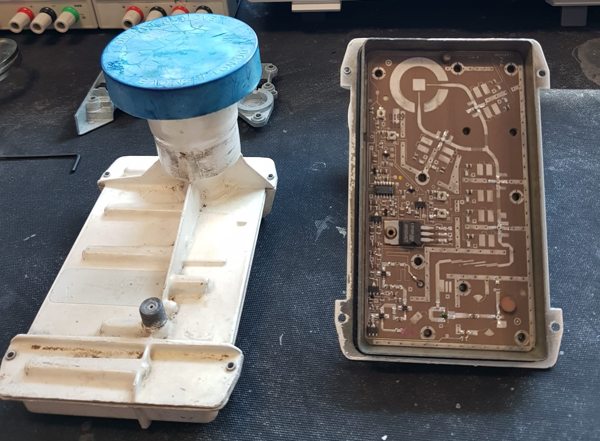

For converting this into a a transmitter, esentially the path for signals that would have originated from the waveguide need to be reversed.

To remove the PCB to work on it, all retaining bolts have to be removed from the screening case and lastly not forgettting the one on the 7805 heat sink with an allen key.

The F-type connector input is only soldered to the PCB, and desoldering this will set the PCB free. The board is very thin so care must be taken.

Since this will be turned into a transmitter, all the components in the **IF Amplifier** shown as a red box are removed as they are not needed.

The 3 leg mixer needs to be removed, since no IF is being created and all the power is now wanted towards the waveguide. This is found as a component with dark-green varnish on top.

Where this used to sit, a 4.7pF SMD capacitor can be soldered across.

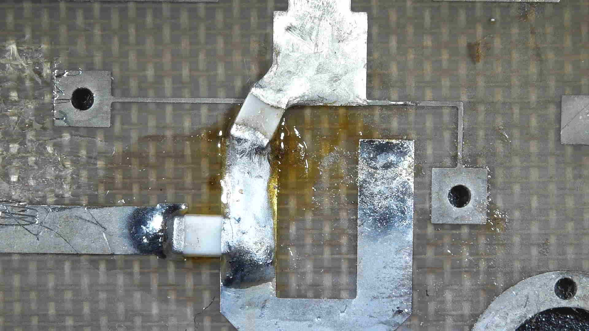

The notch filter also needs removing and the bandpass filter bridging. I used a scalpel to remove traces and for the bandpass filter solder copper tape or a wire across the whole filter.

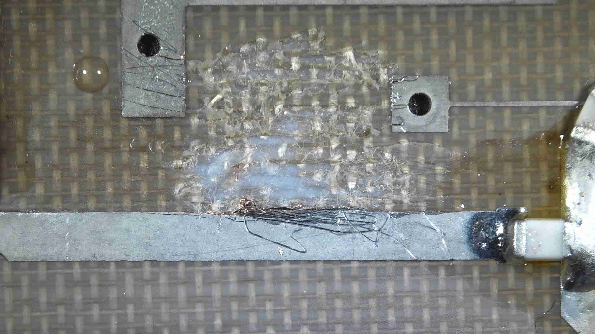

GASFETs T1H/V, T2 and T3 all have coloured dots on top to identify what they are. Once noted their position they can be removed and stored safely.

<u><b>Positions for my set:</b></u>

<ul>
  <li><b>White</b> - T1H/V</li>
  <li><b>Red</b> - T2</li>
  <li><mark><b>Black</b></mark> - T3</li>
</ul>

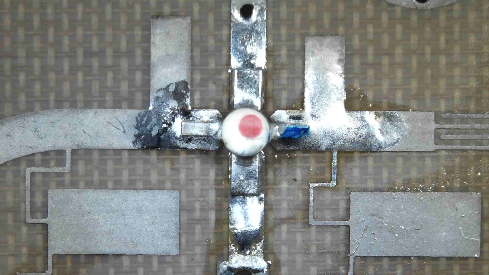

*Note that this GASFET has its orientation modified which will be explained*

The ordering of these GASFETs need to be reversed, and each fliped 180 degrees - see that on the diagram below the gate direction is flipped (usually the gate can be identified as a shorter leg that has a 45 degree cut out of it).

    

        
    

    

		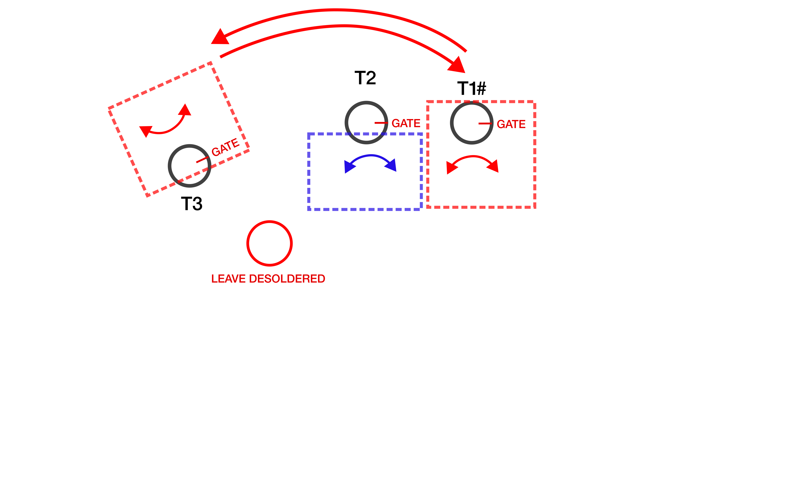
    

Of course replacing the position of the GASFETs, the biasing resistors and corresponding capacitors need to be swapped too in both their position and orientation (since gate and drain are swapped). Since T2 is only flipped its biasing circuit only needs to be flipped.

Doing this power going to the GASFETs needs to be swapped too - this is done by cutting and soldering new traces by the trimmers such that the supply and grounds are reversed.

    

        
    

    

		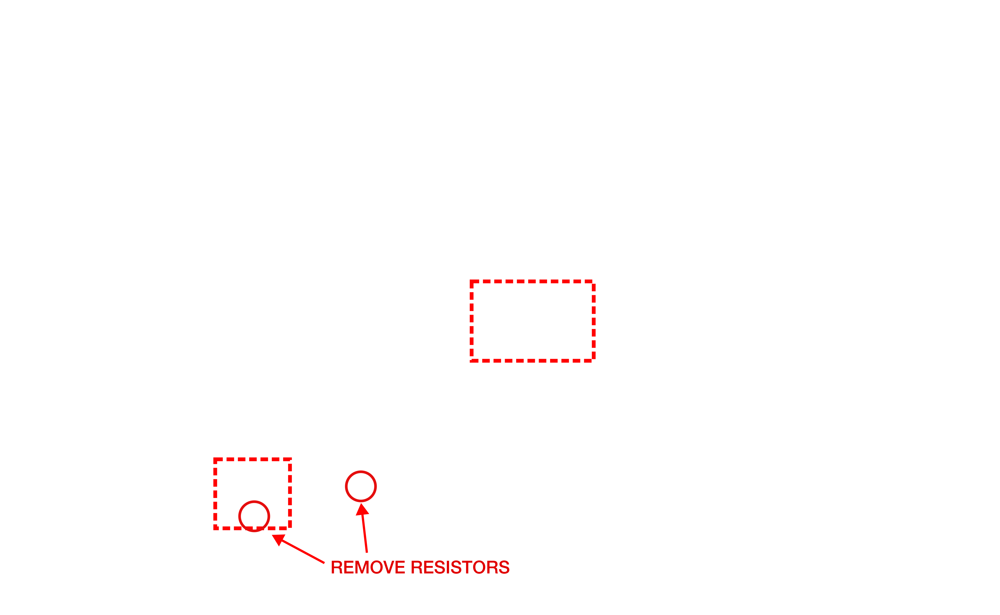
    

Resistors marked are to remove the supply to T1V and the other to make space to solder swapping traces.

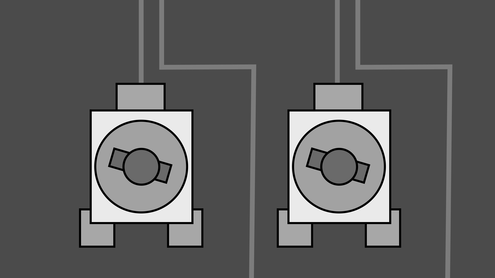 &nbsp; 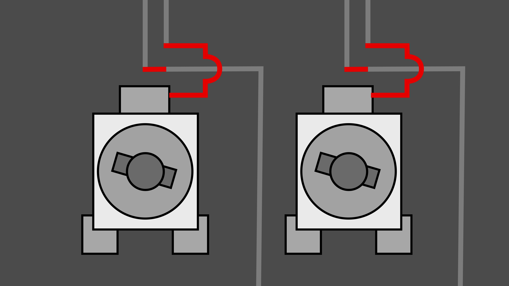

A microscope is definitely needed for this job! To swap traces, I cut out the existing ones and to make my own I took the smallest multicore wire I could find, unravelled it and used a single strand from the wire. I did not have any thin enough enammeled wire to cross over the top of my new trace so with the smallest I could find I jumped between SMD components with larger pads.

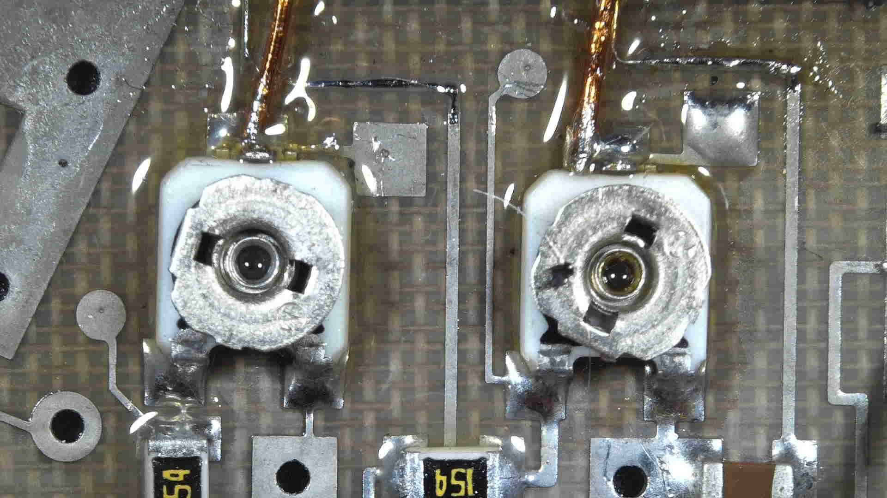 &nbsp; 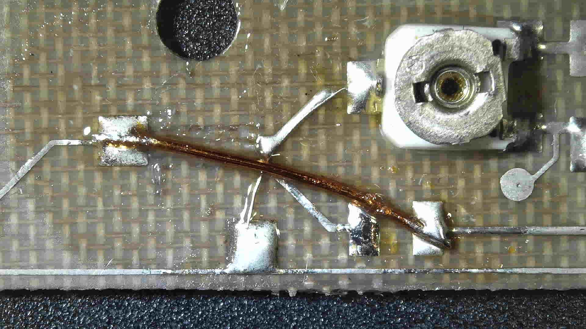

That is the modifications complete. Power levels will need to be fine tuned with the trimmers and the DRO set screw for precise frequency tuning.

To power my transmitter I soldered wires directly to the voltage regulator as I plan to only use CW for now.

Please note that the transmitter will not work unless the screening case is on (as shown in the picture) as the set screw needs to touch the DRO.

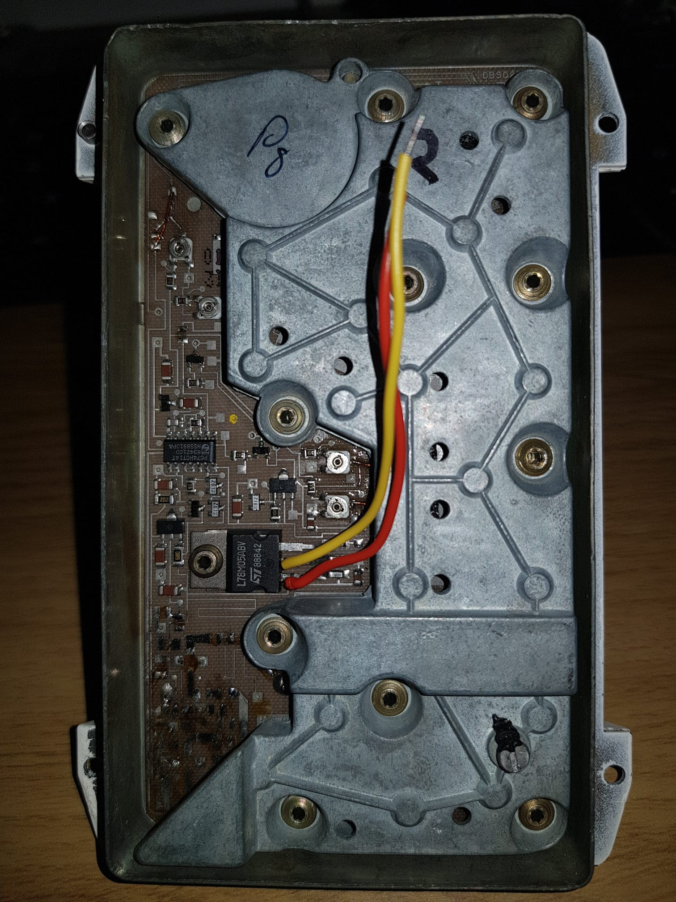

To test the transmitter, I used a unmodified LNB with a satfinder meter to see if any measurable power was being transmitted (as I do not have any microwave test equipment). As used in many famous experiments in the past, a screwdriver, was used to get precise alignment of the two horns.

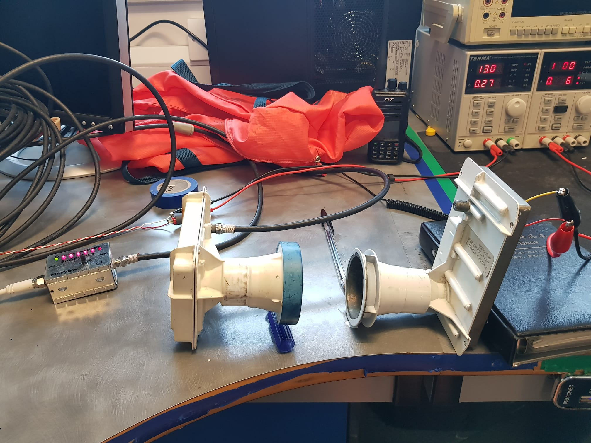